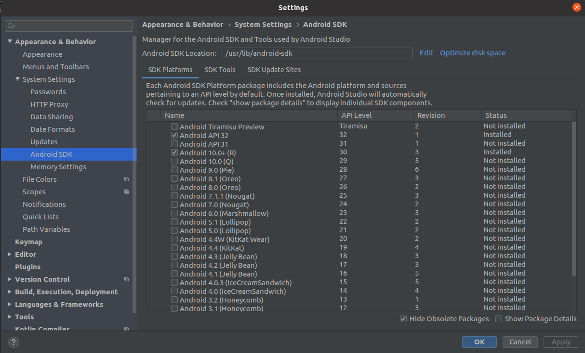
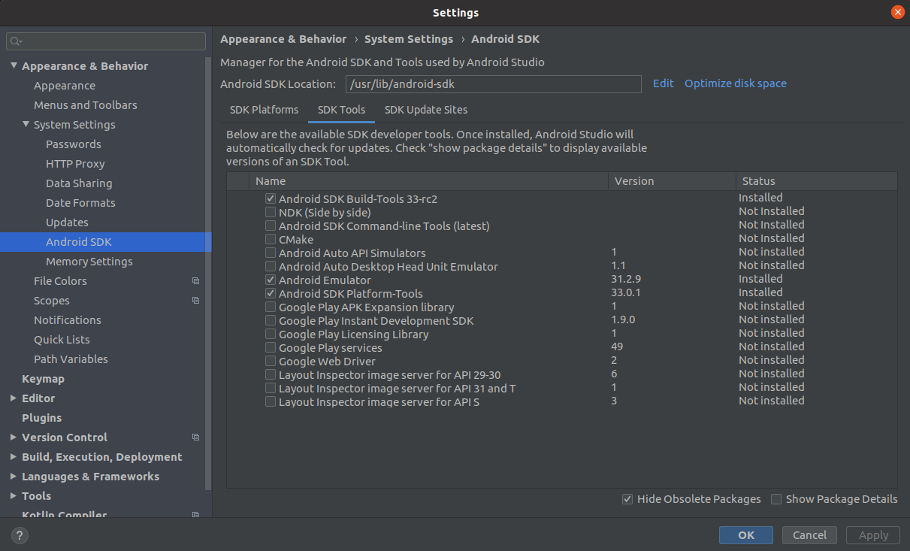
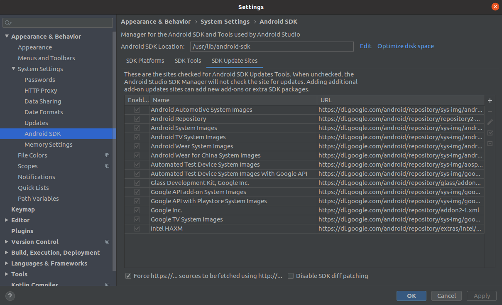

## build using Cordova
- https://wiki.gdevelop.io/gdevelop5/publishing/android\_and\_ios\_with\_cordova
- how to solve the encountered problems:
	- https://stackoverflow.com/questions/70002327/ionic-cordova-android-no-usable-android-build-tools-found-highest-30-x-install
	- install Java 8 (not 11)
		- Cordova had some problems with Java 11
		- https://tecadmin.net/install-oracle-java-8-ubuntu-via-ppa/
	- install Android SDK
		- https://stackoverflow.com/questions/34556884/how-to-install-android-sdk-on-ubuntu
	- add to bashrc:
	```
	# export JAVA_HOME=/usr/lib/jvm/java-11-openjdk-amd64
	export JAVA_HOME=/usr/lib/jvm/java-8-openjdk-amd64
	export JRE_HOME=/usr/lib/jvm/java-8-openjdk-amd64/jre

	if [ -d "$JAVA_HOME/bin" ] ; then
	  PATH="$PATH:$JAVA_HOME/bin"
	fi

	export ANDROID_SDK_ROOT=/usr/lib/android-sdk
	```
	- use vpn to update Android SDK stuff (open Android Studio while vpn is on)
		- check the Android Studio logs for 403 messages
	- run Android Studio as root (because the installed SDK is read-only) (or you can make it writable!)
	- click on **force https** to download additional libs in Android Studio
		- https://stackoverflow.com/questions/10181168/failed-to-fetch-url-https-dl-ssl-google-com-android-repository-addons-list-1-x
	- show # TODO
	- delete old Android SDK build tools (you can uninstall from Android Studio)
	- install a version newer than 30.0.3
	- if you want to delete exported folder then do:
		- https://stackoverflow.com/questions/53337269/path-js1086-error-enoent-no-such-file-or-directory-uv-cwd
	- Android Studio should looks like this:
		- 
		- 
		- 
